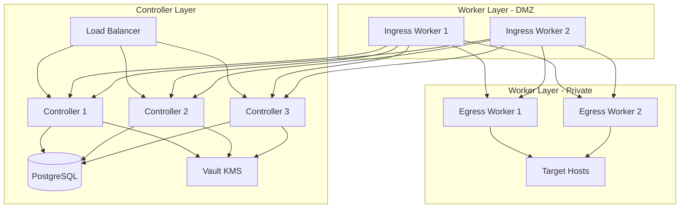

# Boundary Lab Deployment

An Ansible and Terraform-based deployment for HashiCorp Boundary in a lab environment.

## Architecture



## Repository Structure
```
boundary-deployment/
├── ansible/
│   ├── group_vars/
│   │   ├── all.yml                    # Common variables
│   │   ├── boundary_controllers.yml   # Controller-specific vars
│   │   └── boundary_workers.yml       # Worker-specific vars
│   ├── inventory/
│   │   ├── example.yml               # Example inventory structure
│   │   └── hosts.yml                 # Deployment inventory
│   ├── playbooks/
│   │   ├── base_setup.yml           # Common RHEL configuration
│   │   ├── controller_setup.yml     # Controller installation
│   │   ├── deploy_boundary.yml      # Main deployment playbook
│   │   ├── security_hardening.yml   # Basic security config
│   │   └── worker_setup.yml         # Worker installation
│   └── templates/
│       ├── boundary.env.j2          # Environment config
│       ├── controller.hcl.j2        # Controller config
│       ├── terraform.tfvars.j2      # Terraform variables
│       └── worker.hcl.j2            # Worker config
└── terraform/
    ├── boundary
    │   ├── main.tf                      # Core Boundary config
    │   ├── outputs.tf                   # Output definitions
    │   ├── variables.tf                 # Variable definitions
    │   └── terraform.tfvars_example     # Example variables file
    └── vault
        ├── main.tf                      # Vault config
        ├── outputs.tf                   # Output definitions
        ├── variables.tf                 # Variable definitions
        └── terraform.tfvars_example     # Example variables file
```

## Prerequisites
- RHEL/CentOS 8 or higher
- HashiCorp Vault (for KMS)
- PostgreSQL database
- Ansible 2.9+
- Terraform 1.0+

## Deployment Process

### 1. Controller Deployment
The controller layer provides the Boundary control plane and API.

1. **Prepare Configuration**
```bash
# Copy and modify inventory
cp inventory/example.yml inventory/hosts.yml

# Update group variables as needed
vim group_vars/boundary_controllers.yml
```

2. **Deploy Controllers**
```bash
# Run base setup and controller deployment
ansible-playbook -i inventory playbooks/base_setup.yml
ansible-playbook -i inventory playbooks/controller_setup.yml
```

Key Features:
- High availability with 3 controllers
- Vault KMS integration
- PostgreSQL backend
- TLS configuration
- Systemd service management

### 2. Worker Deployment
Workers handle session proxying between clients and targets.

1. **Configure Workers**
```bash
# Update worker-specific variables
vim group_vars/boundary_workers.yml
```

2. **Deploy Workers**
```bash
# Deploy worker nodes
ansible-playbook -i inventory playbooks/worker_setup.yml
```

Worker Types:
- **Ingress Workers**: Entry point for client connections (DMZ)
- **Egress Workers**: Exit point for target connections (Private network)

### 3. Boundary Configuration
After infrastructure deployment, configure Boundary using Terraform:

```bash
cd terraform
terraform init
terraform apply
```

This configures:
- Organization and project scopes
- Authentication methods
- Roles and policies
- Managed groups

## Network Architecture

### Controller Layer
- API (9200): Client connections
- Cluster (9201): Worker coordination
- Ops (9203): Health checks/metrics

### Worker Layer
- Proxy (9202): Session connections

## Group Variables

### all.yml
- Common configurations
- Vault settings
- Global network configs

### boundary_controllers.yml
- Controller-specific settings
- KMS configurations
- Database connections

### boundary_workers.yml
- Worker authentication
- Network segmentation
- Tag configurations