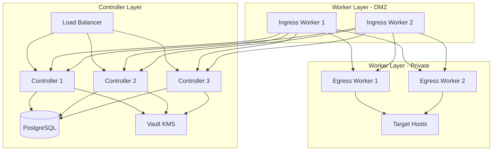

# Boundary Lab Deployment 🚀

An Ansible and Terraform-based deployment for HashiCorp Boundary in a lab environment.

## Prerequisites Checklist ✅

Before starting deployment, ensure you have:

1. **Infrastructure Ready**
   - RHEL/CentOS 8 or higher servers for controllers
   - RHEL/CentOS 8 or higher servers for workers
   - PostgreSQL database instance
   - Load balancer configured
   - Network connectivity between all components
   - SSL certificates from a trusted CA

2. **HashiCorp Stack**
   - HashiCorp Vault instance (for KMS)
   - Terraform 1.0+
   - Ansible 2.9+

## Repository Structure 📁
```
boundary-deployment/
├── ansible/
│   ├── group_vars/
│   │   ├── all.yml                    # Common variables
│   │   ├── boundary_controllers.yml   # Controller-specific vars
│   │   └── boundary_workers.yml       # Worker-specific vars
│   ├── inventory/
│   │   ├── example.yml               # Example inventory structure
│   │   └── hosts.yml                 # Deployment inventory
│   ├── playbooks/
│   │   ├── base_setup.yml           # Common RHEL configuration
│   │   ├── controller_setup.yml     # Controller installation
│   │   ├── deploy_boundary.yml      # Main deployment playbook
│   │   ├── security_hardening.yml   # Basic security config
│   │   └── worker_setup.yml         # Worker installation
│   └── templates/
│       ├── boundary.env.j2          # Environment config
│       ├── controller.hcl.j2        # Controller config
│       ├── terraform.tfvars.j2      # Terraform variables
│       └── worker.hcl.j2            # Worker config
└── terraform/
    ├── boundary
    │   ├── main.tf                      # Core Boundary config
    │   ├── outputs.tf                   # Output definitions
    │   ├── variables.tf                 # Variable definitions
    │   └── terraform.tfvars_example     # Example variables file
    └── vault
        ├── main.tf                      # Vault config
        ├── outputs.tf                   # Output definitions
        ├── variables.tf                 # Variable definitions
        └── terraform.tfvars_example     # Example variables file
```

## Deployment Process 🎯

### 1. Clone Repository
```bash
git clone https://github.com/yourusername/boundary-deployment
cd boundary-deployment
```

### 2. Configure Vault (Required First!) 🔐
The Vault configuration must be done first as it sets up the KMS encryption keys needed by Boundary.

```bash
cd terraform/vault
cp terraform.tfvars.example terraform.tfvars
# Edit terraform.tfvars with your Vault details
terraform init
terraform apply
```

This creates:
- Transit secrets engine
- Encryption keys for Boundary
- Vault policies for controllers and workers
- Authentication tokens

Save the output values - you'll need them for the setup script!

### 3. Prepare Required Information 📋

The setup script (`setup.sh`) will ask for the following information. Have these ready:

**Organization Details**
- Organization name

**Load Balancer**
- DNS/IP address
- Ensure ports 9200, 9201, and 9203 are configured

**TLS Configuration**
- Path to SSL certificate
- Path to SSL private key

**Database Configuration**
- PostgreSQL host
- Port (default: 5432)
- Database name
- Username
- Password

**Vault Configuration**
- Vault server URL
- Transit path
- Vault token (from step 2)

**Controller Configuration**
- Number of controllers (recommend 3)
- IP address for each controller
- SSH user for each controller

**Worker Configuration**
- Number of ingress workers
- IP address for each ingress worker
- SSH user for each ingress worker
- Number of egress workers
- IP address for each egress worker
- SSH user for each egress worker

### 4. Run Setup Script 🛠️
```bash
sudo ./setup.sh
```

### 5. Deploy Infrastructure 🏗️

#### Controller Deployment
The controller layer provides the Boundary control plane and API.

```bash
ansible-playbook -i inventory/hosts.yml playbooks/deploy_boundary.yml --ask-vault-pass
```

#### Worker Deployment
Workers handle session proxying between clients and targets.

1. **Configure Workers**
```bash
# Update worker-specific variables
vim group_vars/boundary_workers.yml
```

2. **Deploy Workers**
```bash
# Deploy worker nodes
ansible-playbook -i inventory playbooks/worker_setup.yml
```

Worker Types:
- **Ingress Workers**: Entry point for client connections (DMZ)
- **Egress Workers**: Exit point for target connections (Private network)

### 6. Configure Boundary 🎮

```bash
cd terraform/boundary
terraform init
terraform apply
```

## Configuration Files 📝

### Group Variables

#### all.yml
- Common configurations
- Vault settings
- Global network configs

#### boundary_controllers.yml
- Controller-specific settings
- KMS configurations
- Database connections

#### boundary_workers.yml
- Worker authentication
- Network segmentation
- Tag configurations

## Architecture 🏛️



## Network Requirements 🌐

### Controller Layer
- API (9200): Client connections
- Cluster (9201): Worker coordination
- Ops (9203): Health checks/metrics

### Worker Layer
- Proxy (9202): Session connections