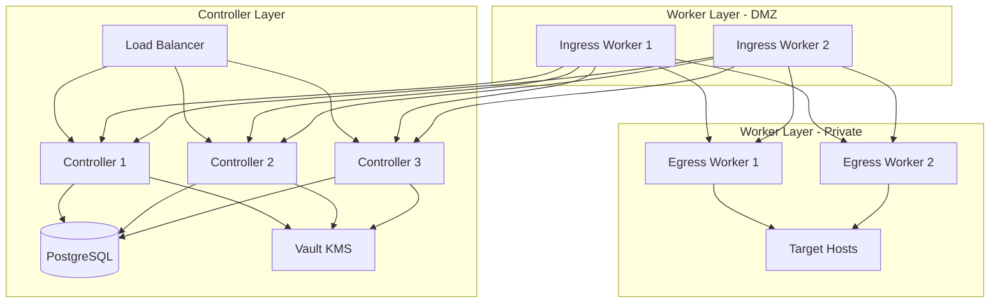

# Boundary Lab Deployment 🚀

An Ansible and Terraform-based deployment for HashiCorp Boundary in a lab environment.

## Prerequisites Checklist ✅

Before starting deployment, ensure you have:

1. **Infrastructure Ready**
   - RHEL/CentOS 8 or higher servers for controllers
   - RHEL/CentOS 8 or higher servers for workers
   - PostgreSQL database instance
   - Load balancer configured
   - Network connectivity between all components
   - SSL certificates from a trusted CA

2. **HashiCorp Stack**
   - HashiCorp Vault instance (for KMS)
   - Terraform 1.0+
   - Ansible 2.9+

## Repository Structure 📁
```
boundary-deployment/
├── ansible/
│   ├── group_vars/
│   │   ├── all.yml                    # Common variables
│   │   ├── boundary_controllers.yml   # Controller-specific vars
│   │   └── boundary_workers.yml       # Worker-specific vars
│   ├── inventory/
│   │   ├── example.yml               # Example inventory structure
│   │   └── hosts.yml                 # Deployment inventory
│   ├── playbooks/
│   │   ├── base_setup.yml           # Common RHEL configuration
│   │   ├── controller_setup.yml     # Controller installation
│   │   ├── deploy_boundary.yml      # Main deployment playbook
│   │   ├── security_hardening.yml   # Basic security config
│   │   └── worker_setup.yml         # Worker installation
│   └── templates/
│       ├── boundary.env.j2          # Environment config
│       ├── controller.hcl.j2        # Controller config
│       ├── terraform.tfvars.j2      # Terraform variables
│       └── worker.hcl.j2            # Worker config
└── terraform/
    ├── boundary
    │   ├── main.tf                      # Core Boundary config
    │   ├── outputs.tf                   # Output definitions
    │   ├── variables.tf                 # Variable definitions
    │   └── terraform.tfvars_example     # Example variables file
    └── vault
        ├── main.tf                      # Vault config
        ├── outputs.tf                   # Output definitions
        ├── variables.tf                 # Variable definitions
        └── terraform.tfvars_example     # Example variables file
```

## Deployment Process 🎯

### 1. Clone Repository
```bash
git clone https://github.com/yourusername/boundary-deployment
cd boundary-deployment
```

### 2. Auto or manual install
[Auto install](README_auto_config.md)
[Manual install](README_manual_config.md.md)

## Configuration Files 📝

### Group Variables

#### all.yml
- Common configurations
- Vault settings
- Global network configs

#### boundary_controllers.yml
- Controller-specific settings
- KMS configurations
- Database connections

#### boundary_workers.yml
- Worker authentication
- Network segmentation
- Tag configurations

## Architecture 🏛️



## Network Requirements 🌐

### Controller Layer
- API (9200): Client connections
- Cluster (9201): Worker coordination
- Ops (9203): Health checks/metrics

### Worker Layer
- Proxy (9202): Session connections